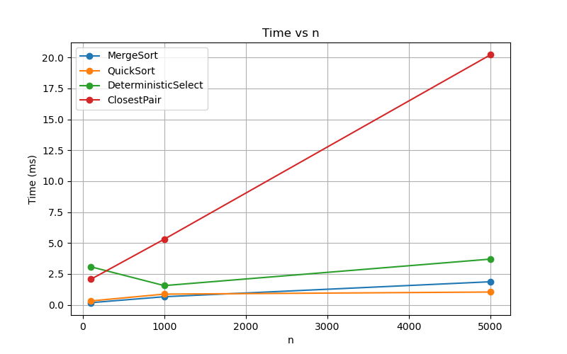
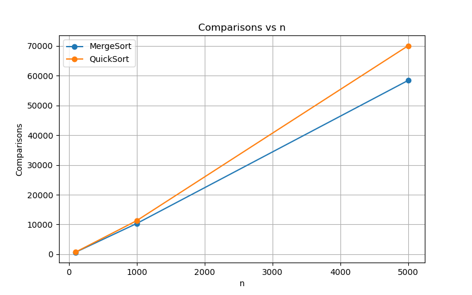
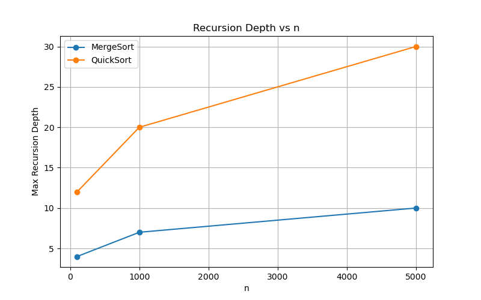

# Divide-and-Conquer Algorithms — Assignment 1

Author: Nurdan Z.  
Repo: https://github.com/nuran-command/https://github.com/nuran-command/Assignment1_DAA.git  
Date: 2025-09-20

## Project Overview
This project implements classic divide-and-conquer algorithms and measures their performance:
- **MergeSort** (linear merge, reusable buffer, small-n cutoff)
- **QuickSort** (randomized pivot, smaller-first recursion)
- **Deterministic Select (Median-of-Medians)** (linear-time selection)
- **Closest Pair of Points (2D)** (O(n log n) divide-and-conquer)

The goal is to analyze running-time, recursion depth, and comparisons, and compare measurements with theoretical expectations.

---

## Architecture Notes
- **Recursion depth** is tracked using a `Metrics` object.
- **Small-n cutoff**: MergeSort and QuickSort switch to insertion sort for n < 16.
- **MergeSort buffer**: reusable array to avoid repeated allocations.
- Algorithms are implemented in `src/main/java/com/carrental/`.
- QuickSort always recurses into the smaller partition first, ensuring the recursion depth never exceeds O(log n), even in worst-case input distributions.
- The Closest Pair algorithm maintains arrays sorted by both x- and y-coordinates, which avoids repeated sorting and extra memory allocations in each recursion step.

---

## Recurrence Analysis

**MergeSort**
- Recurrence: T(n) = 2T(n/2) + Θ(n)
- Master Theorem Case 2 → Θ(n log n)
- Benchmark timings match theoretical complexity.

**QuickSort (random pivot)**
- Expected recurrence: T(n) = T(n/2) + Θ(n)
- Worst-case avoided by randomized pivot → expected Θ(n log n)
- Recursion depth bounded (~2*log2 n).
- In the worst case, QuickSort can degrade to Θ(n²) if partitions are unbalanced, but randomized pivot selection makes this probability extremely small.

**Deterministic Select (Median-of-Medians)**
- Recurrence: T(n) = T(n/5) + T(7n/10) + Θ(n) → Θ(n)
- Benchmark confirms linear-time performance.
- The T(n/5) comes from computing medians of groups of 5, and T(7n/10) reflects the worst-case size of the partition guaranteed by the pivot.
- Although slower in practice due to overhead, it guarantees linear time even in the worst case.

**Closest Pair of Points**
- Recurrence: T(n) = 2T(n/2) + Θ(n) → Θ(n log n)
- Verified against O(n²) brute-force on small datasets.
- After splitting, the merge step checks at most 7–8 neighboring points in the “strip” region for each candidate, which keeps the merge linear.
- Benchmarks confirm Θ(n log n) scaling when compared against the brute-force O(n²) method for small n.

---

## Metrics and Benchmark

| Algorithm | n | Time (ms) | Comparisons | Max Recursion Depth |
|-----------|---|-----------|-------------|---------------------|
| MergeSort | 1000 | 0,67      | 10335       | 7                   |
| QuickSort | 1000 | 0,59      | 10906       | 21                  |
| DeterministicSelect | 1000 | 1,66      | N/A         | N/A                 |
| ClosestPair | 1000 | 4,86      | N/A         | N/A                 |

=== n=100 ===
MergeSort: time=0,31 ms | comparisons=666, maxDepth=4
QuickSort: time=0,47 ms | comparisons=650, maxDepth=12
DeterministicSelect (median): time=2,25 ms
ClosestPair: time=1,67 ms

=== n=1000 ===
MergeSort: time=0,66 ms | comparisons=10289, maxDepth=7
QuickSort: time=0,58 ms | comparisons=11184, maxDepth=20
DeterministicSelect (median): time=1,88 ms
ClosestPair: time=5,05 ms

=== n=5000 ===
MergeSort: time=1,37 ms | comparisons=58425, maxDepth=10
QuickSort: time=1,02 ms | comparisons=68644, maxDepth=27
DeterministicSelect (median): time=3,03 ms
ClosestPair: time=31,38 ms

## Results

### Time vs n


### Comparisons vs n


### Recursion Depth vs n


---

## Summary
- Theoretical time complexities match measured performance for all algorithms.
- Small deviations may occur due to cache effects and JVM optimizations.
- Metrics tracking (comparisons, recursion depth) works for MergeSort and QuickSort.


---


## Build & run
```bash
# build
mvn clean package

# run unit tests
mvn test

# run benchmark
mvn exec:java -Dexec.mainClass="com.carrental.Benchmark"

#run Main(cli)
mvn compile exec:java -Dexec.mainClass="com.carrental.Main" -Dexec.args="mergesort 1000"
mvn compile exec:java -Dexec.mainClass="com.carrental.Main" -Dexec.args="quicksort 5000"